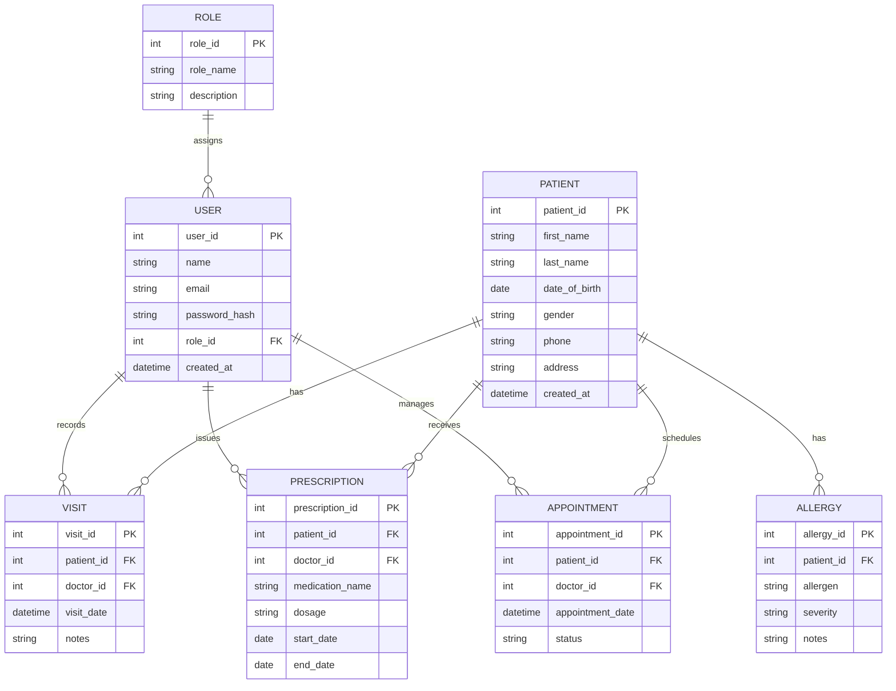

## Entity Relationship Diagram (ERD)

Note: `doctor_id` refers to a USER with role = "Doctor".

```mermaid
erDiagram
    USER {
        int user_id PK
        string name
        string email
        string password_hash
        int role_id FK
        datetime created_at
    }

    ROLE {
        int role_id PK
        string role_name
        string description
    }

    PATIENT {
        int patient_id PK
        string first_name
        string last_name
        date date_of_birth
        string gender
        string phone
        string address
        datetime created_at
    }

    VISIT {
        int visit_id PK
        int patient_id FK
        int doctor_id FK
        datetime visit_date
        string notes
    }

    PRESCRIPTION {
        int prescription_id PK
        int patient_id FK
        int doctor_id FK
        string medication_name
        string dosage
        date start_date
        date end_date
    }

    ALLERGY {
        int allergy_id PK
        int patient_id FK
        string allergen
        string severity
        string notes
    }

    APPOINTMENT {
        int appointment_id PK
        int patient_id FK
        int doctor_id FK
        datetime appointment_date
        string status
    }

    ROLE ||--o{ USER : assigns
    USER ||--o{ VISIT : records
    USER ||--o{ PRESCRIPTION : issues
    USER ||--o{ APPOINTMENT : manages

    PATIENT ||--o{ VISIT : has
    PATIENT ||--o{ PRESCRIPTION : receives
    PATIENT ||--o{ ALLERGY : has
    PATIENT ||--o{ APPOINTMENT : schedules
```